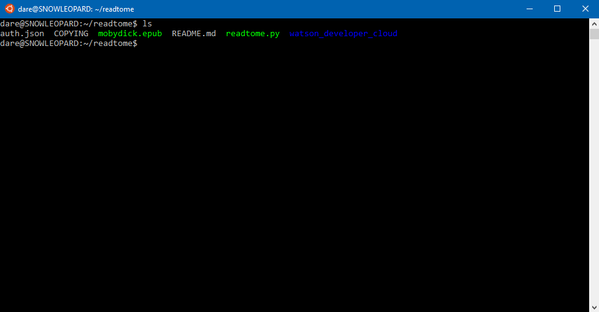

ReadTome
========

A tool for converting ebooks into audiobooks with IBM's Watson Cognitive Services TTS API.

Dependencies
------------

- python3
- python3-requests
- python3-ebooklib
- watson-developer-cloud (bundled: https://github.com/watson-developer-cloud/python-sdk)

License
-------

ReadTome is released under the GNU General Public License, version 3.0. For more informaion, please see [`COPYING`](COPYING).
